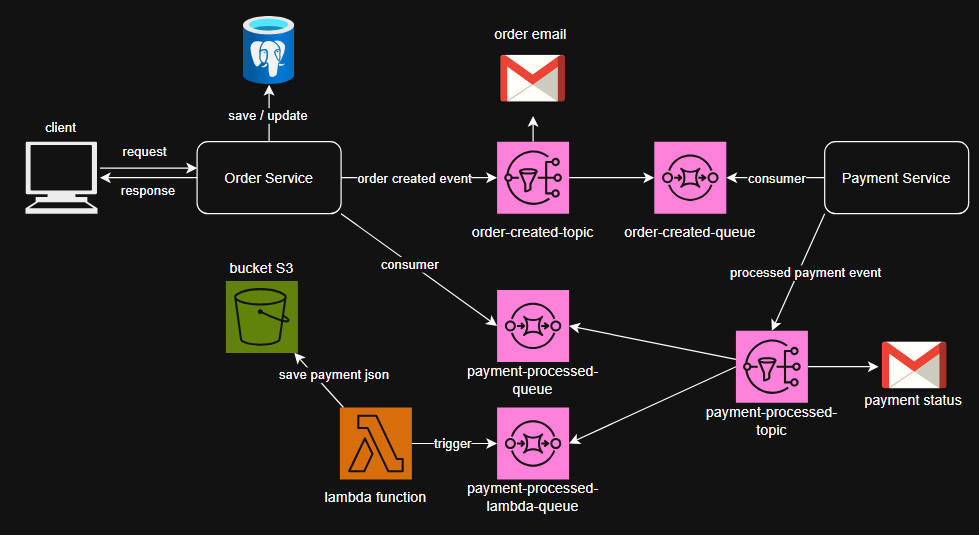

# E-Commerce Event Driven Architecture
Project for studying EDA and AWS services
- POST /api/products - to create a product
- GET /api/products - to get all the products (get the productId for make a order)
- POST /api/orders - to make a order (the product must exist)
- GET /api/orders - to see the payment status updating

## Technologies
- Java 21
- Spring Boot
- SNS
- SQS
- Lambda
- S3

## Architecture

